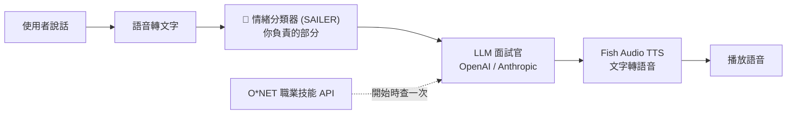

# SAILER Emotion Classifier REST API 建置計劃

## 背景說明

你的朋友正在做一個 **LangGraph 面試模擬器**，整個系統有 4 個外部服務需要串接：



### 你朋友提到的三件事解釋

| 他說的 | 意思 | 你需要做嗎？ |
|---|---|---|
| **「TTS 有內建的 API 可以用」** | Fish Audio 的文字轉語音引擎已經自帶 REST API（`POST /v1/tts`），不用自己寫 wrapper | ❌ 不用你處理 |
| **「O\*NET 的 API 有很多資訊，有申請到了嗎？」** | O\*NET 是美國勞動部的職業技能資料庫，查詢某職位需要什麼技能。需要先在 [services.onetcenter.org](https://services.onetcenter.org/developer/) 申請帳號 | ⚠️ 幫他申請帳號，但 API wrapping 不是你負責 |
| **「需要你幫忙寫 API，模型的輸入跟輸出格式」** | 把你的 SAILER 情緒分類模型包成 REST API，讓他的 LangGraph 可以 `POST /classify-emotion` 呼叫 | ✅ **這是你的核心任務** |

---

## 你的任務：建置 `POST /classify-emotion` REST API

### 架構概覽

```
用戶端 (LangGraph)                          你的 API 伺服器 (FastAPI)
┌─────────────────────┐                    ┌────────────────────────────────────┐
│ POST /classify-emotion │ ──── HTTP ────▶ │  1. 接收音檔 (WAV/MP3)              │  
│ (送出音檔)            │                  │  2. 預處理 (16kHz mono, 3~15s)      │
│                     │ ◀─── JSON ────── │  3. 官方 WhisperWrapper 提取特徵     │
│ (收到情緒結果+AVD)   │                  │  4. SAILER_Model 推理               │
│                     │                    │  5. 回傳 JSON 結果                  │
└─────────────────────┘                    └────────────────────────────────────┘
```

### 模型推理流程 (雙模型串聯)

根據你的 `train.py` 和模型架構，推理時需要串聯兩個模型：

1. **WhisperWrapper** (官方 `tiantiaf/whisper-large-v3-msp-podcast-emotion`) → 提取語音特徵 (1280d)
2. **RoBERTa** (`roberta-large`) → 提取文字特徵 (需要 transcript)
3. **SAILER_Model** (你的 `best_model_f1.pth`) → 融合兩者做最終預測

> [!IMPORTANT]
> **重要發現：你的模型是雙模態 (語音 + 文字)**，但 API spec 只要求傳音檔。
> 
> **方案 A（推薦 - 簡單 baseline）**: 先只用官方 WhisperWrapper 做 speech-only 推理（9 類 → 映射到 8 類），就跟你 `evaluate_official_baseline.py` 的邏輯一樣。這已經有不錯的表現。
> 
> **方案 B（完整版）**: 用你的雙模態 SAILER_Model，但需要額外加 ASR（語音轉文字），增加延遲和複雜度。
> 
> 建議先用 **方案 A** 快速出 baseline，之後再升級。

---

## Proposed Changes

### API Server 模組

#### [NEW] [app.py](file:///home/brant/Project/SAILER_test/app.py)

FastAPI 主程式，包含：

- **模型載入**：啟動時載入 WhisperWrapper + 權重到 GPU
- **`GET /health`**：健康檢查端點
- **`POST /classify-emotion`**：核心情緒分類端點
  - 接收 `multipart/form-data` 音檔
  - 預處理：resample 到 16kHz mono、長度檢查 (3~15s)
  - 推理：WhisperWrapper forward → softmax
  - 回傳：完整 JSON（primary/secondary labels、AVD、embedding）

輸入輸出完全遵守 [api-spec.md](file:///home/brant/Project/SAILER_test/paper/api-spec.md) 的 Section 3a 規格。

#### [NEW] [api_config.py](file:///home/brant/Project/SAILER_test/api_config.py)

API 伺服器配置常數：
- 模型路徑、裝置設定
- 標籤映射（官方 9 類 → 我們的 8 類）
- 音檔限制（最小 3s、最大 15s、sample rate 16kHz）

#### [NEW] [test_api.py](file:///home/brant/Project/SAILER_test/test_api.py)

測試腳本：
- 用 `requests` 送真實音檔測試 API
- 驗證回應格式符合 spec

---

## User Review Required

> [!IMPORTANT]
> **方案選擇**：先用 **方案 A（WhisperWrapper speech-only）** 做 baseline，不需要文字輸入，符合 API spec 的 `multipart/form-data` 只送音檔的設計。你的朋友的 spec 也是這樣寫的。同意嗎？

> [!WARNING]
> **標籤順序不同**：官方 WhisperWrapper 的 9 類順序是 `[Anger, Contempt, Disgust, Fear, Happiness, Neutral, Sadness, Surprise, Other]`，而 API spec 要求的 8 類順序是 `[Neutral, Angry, Sad, Happy, Fear, Disgust, Surprise, Contempt]`。API 會自動做映射轉換，不需要擔心。

> [!NOTE]
> **API 依賴**：需要安裝 `fastapi`、`uvicorn`、`python-multipart`。會更新 `requirements.txt`。

---

## Open Questions

1. **ASR 需求**：你的朋友是否會從 LangGraph 那邊傳 transcript 過來？如果會，之後可以升級到方案 B 使用你的完整雙模態模型。目前先不考慮。

2. **O\*NET 帳號**：你的朋友問「有申請到了嗎？」— 你有去 [O\*NET Developer](https://services.onetcenter.org/developer/) 註冊帳號嗎？這不影響你的 API，但你朋友的 LangGraph 系統需要。

---

## Verification Plan

### Automated Tests
1. 啟動 API server：`uvicorn app:app --host 0.0.0.0 --port 8001`
2. 用測試腳本發送真實音檔驗證回應格式
3. 驗證 health check endpoint
4. 測試邊界情況：太短的音檔、錯誤格式

### Manual Verification
- 確認 JSON 回應結構完全符合 `api-spec.md` Section 3a 的規格
- 確認標籤映射正確（官方 9 類 → 8 類）
