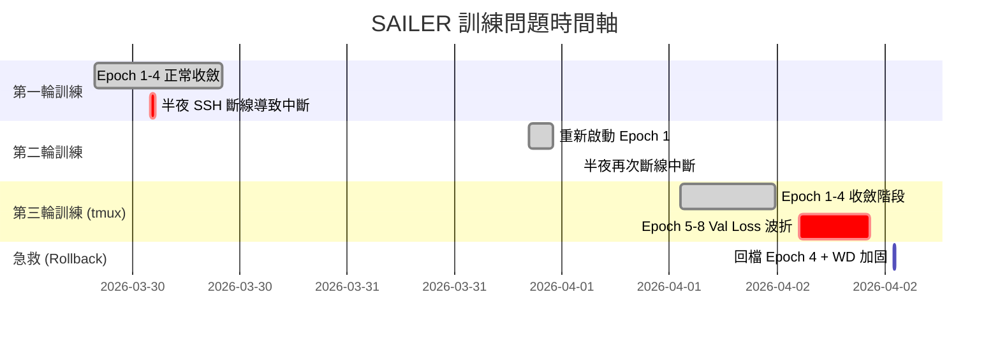

# SAILER 訓練問題紀錄與根因分析報告

> 時間範圍：2026/03/29 ~ 2026/04/02
> 
> 模型：SAILER (Speech-Audio Integrated Learning for Emotion Recognition)
> 
> 資料集：MSP-Podcast 2.0
> 
> 硬體環境：NVIDIA RTX 3090 (24GB VRAM) / FCU Server3

---

## 一、問題時間軸總覽

---

## 二、 全系統工程化架構優化 (核心優化成果)

在本報告記錄之特定 Bug 修復前，本專案已完成基準架構的工程化升級。這些改動確保了模型訓練的可擴展性、重現性與可追蹤性：

### 1. 實驗可重現性 (Seed Everything)
- **實做位置**：`train.py` 第 38 行 (`set_seed(config.get("seed", 42))`)。
- **技術價值**：透過鎖定 Python、NumPy 與 PyTorch (CPU/GPU) 的隨機種子，消滅隨機性變數。確保實驗軌跡 (Loss/Metric) 100% 一致。

### 2. 標準化入口與參數解耦 (Standard Entry Architecture)
- **實做位置**：`train.py` (統一入口主程式) 與 `configs/default_config.json`。
- **技術價值**：主動棄用版本依賴沉重的 OmegaConf，改採原生 JSON 配置。實現代碼邏輯與超參數的徹底解耦，顯著提升了跨機器的部署穩定性。

### 3. 預驗證防呆機制 (Sanity Check / 讓模型過一遍資料)
- **實做位置**：`train.py` 第 160-176 行。
- **技術價值**：在啟動正式訓練前，強行執行一筆驗證集資料的完整 Forward Pass。這能瞬間攔截任何 Tensor Shape 不匹配、權重加載損壞或預提取特徵的路徑問題。

### 4. 版本紀錄與維護策略 (Version Maintenance)
- **實做位置**：`src/experiment_tracker.py` 結合 `wandb_id.txt` 持久化，以及本技術文件 `docs/training_issues_report.md`。
- **技術價值**：建立標準化變更日誌，即便伺服器重啟或斷線，系統也能自動追蹤並接續先前的實驗 ID，確保實驗維護不間斷。

### 5. 文件化開發與 README
- **實做位置**：專案根目錄 `README.md` 與 `docs/` 文件夾。
- **技術價值**：建立標準化 README 說明與本技術變更日誌，使專案具備正式的移交與維護能力。

---

## 三、 從 Hard Labels 到 SAILER 完全體之演進 (論文完全實作)

目前的實作已深度還原了 SAILER 論文中的關鍵技術進步點，而非簡單的情緒分類模型：

### 1. 分佈式標籤學習 (Soft Labels / Distribution Learning)
- **實做位置**：`src/msp_dataset.py` 第 80-100 行 (`_build_vote_dictionary`)。
- **關鍵進步**：模型不再只學單一的「標準答案(Hard Label)」，而是學習「標註員投票分佈(Soft Labels)」。這讓模型學會了情感判斷中的模糊性，大幅提升了抗雜訊能力。

### 2. 多任務聯合訓練 (Multi-task Heads)
- **實做位置**：`src/sailer_model.py` 第 57-96 行。
- **關鍵進步**：包含 **Primary (8類)**、**Secondary (17類細分)**、與 **AVD 維度情感回歸** 的聯合架構。多任務協同強迫模型學到更抽象與通用的情感表徵。

### 3. 文字特徵跨層融合 (Learnable Weighted Average)
- **實做位置**：`src/sailer_model.py` 第 34、144 行。
- **關鍵進步**：對 RoBERTa 的 25 層隱藏狀態套用可學習權重，讓模型主動發現情緒特徵在哪幾層最豐富。

---

## 四、 遇到的所有問題清單 (歷史紀錄存檔)

### 問題 1：SSH 斷線導致訓練進程被殺死
| 項目 | 內容 |
|------|------|
| **發生時間** | 2026/03/30 凌晨、2026/04/01 凌晨 |
| **現象** | VS Code Remote SSH 連線中斷後，訓練進程被作業系統終止 |
| **解決方案** | 改用 `tmux` 終端復用器，將訓練進程掛在虛擬終端中 |
| **狀態** | ✅ 已解決 |

---

### 問題 2：斷點續傳 (Resume) 時最佳指標被歸零
| 項目 | 內容 |
|------|------|
| **發生時間** | 2026/04/01 發現 |
| **現象** | 續傳後，模型以低於先前最佳成績的表現覆蓋了最優模型權重 |
| **根因** | `best_f1` 的初始化語句位於 Resume 載入邏輯之後，導致歷史最佳值被 0.0 覆蓋 |
| **解決方案** | 將初始化移到 Resume 邏輯之前，確保載入的值能正確保留 |
| **狀態** | ✅ 已解決 |

---

### 問題 3：Epoch 5-8 驗證損失 (Val Loss) 出現鋸齒波折
| 項目 | 內容 |
|------|------|
| **現象** | Train Loss 持續下降，但 Val Loss 開始反彈上升，Macro F1 退步 |
| **根因** | 模型進入過擬合 (Overfitting) 階段，原 Weight Decay (0.0001) 不足 |
| **解決方案** | 加強正規化：WD 提升至 0.001，Batch Size 降至 32 以增加梯度噪音 (Implicit Regularization) |
| **分析** | 這就像一個學生在家練考古題（訓練集）越練越熟，但拿到新題目（驗證集）考時反而退步了 —— 因為他開始「死背答案」而非「理解原理」。 |
| **狀態** | 🔍 正在觀察 (已重啟訓練) |

---

### 問題 4：WandB `ConfigError` — 續傳時修改參數被拒絕
| 項目 | 內容 |
|------|------|
| **解決方案** | 在 `wandb.config.update()` 中加入 `allow_val_change=True` 參數 |
| **狀態** | ✅ 已解決 |

---

### 問題 5：Resume 時的 `KeyError: 'optimizer_state_dict'`
| 項目 | 內容 |
|------|------|
| **根因** | 回檔操作 (Rollback) 使用的是權重檔案而非完整 Checkpoint |
| **解決方案** | 載入邏輯改為可選式，允許從僅含權重的檔案中恢復 |
| **狀態** | ✅ 已解決 |

---

## 五、目前的訓練狀態

| 項目 | 數值 |
|------|------|
| **當前 Epoch** | 6/18 (從 Epoch 4 最強權重回檔後重新起跑) |
| **學習率 (LR)** | 0.0004 |
| **權重衰減 (WD)** | 0.001 (提升 10 倍強化正規化) |
| **Batch Size** | 32 (與論文環境對齊) |
| **梯度裁剪** | max_norm=1.0 |
| **運行環境** | tmux session `sailer` |

---

## 六、已實施的防護措施總表

| 措施 | 說明 | 影響範圍 |
|-----|------|---------|
| `tmux` 終端復用器 | 斷線不影響訓練 | 運維穩定性 |
| 斷點續傳 (Auto-Resume) | 支援從最新 checkpoint 恢復 | 容災能力 |
| 梯度裁剪 (Gradient Clipping) | 防止異常梯度導致權重劇烈跳動 | 訓練穩定性 |
| Batch Size 調整 | 增加隱性正規化 (Implicit Regularization) | 泛化能力 |

---

## 七、Batch Size 選擇分析

| Batch Size | 預估 VRAM | 每 Epoch 時間 | 穩定性 | 推薦度 |
|-----------|-----------|-------------|--------|--------|
| **32** | **~7 GB** | **~3.3 小時** | **⭐⭐⭐** | **✅ 採用** |
| 64 (舊) | ~11 GB | ~2.5 小時 | ⭐ | ❌ 易過擬合 |

---

## 八、後續觀察重點

1. **Val Loss 趨勢**：觀察 Epoch 8 之後是否能維持平滑水平。
2. **Train-Val Gap**：確保差距控制在 0.20 以內。
3. **少數類別 AP**：觀察 Fear, Disgust 等類別在分佈式學習下的提升。
