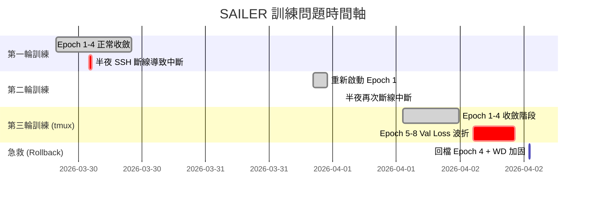

# SAILER 訓練問題紀錄與根因分析報告

> 時間範圍：2026/03/29 ~ 2026/04/02
> 
> 模型：SAILER (Speech-Audio Integrated Learning for Emotion Recognition)
> 
> 資料集：MSP-Podcast 2.0
> 
> 硬體環境：NVIDIA RTX 3090 (24GB VRAM) / FCU Server3

---

## 一、問題時間軸總覽

---

## 二、從 Hard Labels 到 SAILER 完全體之演進 (論文完全實作)

自從上次報告的 Hard Labels 基礎模型以來，本專案已根據 SAILER 論文進行了**全面性的架構重寫**。以下列出所有已實作的論文核心技術：

### 2.1 分佈式標籤學習 (Soft Labels / Vote Distribution Learning)
- **實做位置**：`src/msp_dataset.py` 第 80-100 行 (`_build_vote_dictionary`)
- **舊版 (Hard Labels)**：模型只學單一的「多數決答案」，例如一段音檔被標為 "Happy" 就只學 `[0,0,0,1,0,0,0,0]`
- **新版 (SAILER)**：從 `labels_detailed.csv` 聚合所有標註員的原始投票，產生機率分佈，例如 `[0.1, 0, 0, 0.6, 0.2, 0, 0.1, 0]`。模型學的是「人類標註者的共識程度」而非「絕對正確答案」
- **損失函數配合**：從 `CrossEntropyLoss` 改為 `KLDivLoss`（`train.py` 第 96-97 行），計算模型輸出分佈與標註員投票分佈之間的距離

### 2.2 Annotation Dropout (標註機率丟棄)
- **實做位置**：`src/msp_dataset.py` 第 206-215 行 (`_get_target_distribution`)
- **技術細節**：訓練時隨機丟棄 20% 的主流類別 (Neutral, Angry, Sad, Happy) 投票，迫使模型不要過度依賴某個強勢情緒的票數
- **效果**：等同於標籤空間上的 Data Augmentation，增加標籤多樣性

### 2.3 Class Re-weighting (少數類別權重放大)
- **實做位置**：`src/msp_dataset.py` 第 57-62 行與第 219-221 行
- **技術細節**：根據各類別樣本數計算逆頻率權重 `w_norm`，在訓練階段將標籤分佈乘以權重後重新正規化
- **效果**：讓 Fear (4)、Disgust (5)、Surprise (6)、Contempt (7) 等極端少數類別在 Loss 中佔有更大的聲量

### 2.4 多任務聯合訓練 (Multi-task Learning)
- **實做位置**：`src/sailer_model.py` 第 57-96 行（5 個平行輸出頭）
- **舊版**：只有 1 個分類頭 (8 類主情緒)
- **新版 (SAILER)**：同時訓練 5 個任務
  - **Primary Emotion** (8 類分類)：主情緒辨識
  - **Secondary Emotion** (17 類分類)：含 8 種主情緒 + 9 種 Other 子類 (Other-Confused, Other-Amused...)
  - **Arousal** (連續回歸)：激動程度 [0,1]
  - **Valence** (連續回歸)：正負向 [0,1]
  - **Dominance** (連續回歸)：支配度 [0,1]
- **損失組合**：`loss = loss_primary + loss_secondary + loss_avd`（`train.py` 第 218 行，Unweighted Sum）

### 2.5 文字特徵跨層融合 (Learnable Weighted Average)
- **實做位置**：`src/sailer_model.py` 第 34-36 行（權重定義）與第 138-144 行（前向計算）
- **舊版**：只取 RoBERTa 最後一層的輸出
- **新版 (SAILER)**：將 RoBERTa 全部 25 層隱藏狀態堆疊，套用可學習的 Softmax 權重 `text_layer_weights` 進行加權平均。模型在訓練過程中自動發現哪幾層的語意特徵對情感辨識最有價值

### 2.6 L2 Normalization (特徵正規化)
- **實做位置**：`src/sailer_model.py` 第 154-155 行
- **技術細節**：在語音特徵 `s_emb` (256 維) 與文字特徵 `t_emb` (1024 維) 拼接之前，分別執行 `F.normalize(emb, p=2, dim=-1)` 將兩者正規化為單位向量
- **效果**：RoBERTa 的 1024 維輸出數值量級遠大於 256 維的語音下游網路，若不做 L2 Normalization，文字特徵會在梯度中「輾壓」語音特徵，讓模型退化為純文字模型。正規化確保兩個模態在融合時擁有平等的發言權

### 2.7 語音降維網路 (Speech Downstream Network / Pointwise Conv)
- **實做位置**：`src/sailer_model.py` 第 40-49 行
- **技術細節**：3 層 Pointwise 1D Convolution (kernel_size=1)，將 Whisper 的 1280 維特徵逐步壓縮至 256 維，中間穿插 ReLU + Dropout
- **效果**：扮演 Feature Bottleneck (特徵瓶頸)，過濾掉 Whisper 中與情感無關的冗餘聲學資訊 (如說話者身份、環境噪音)

### 2.8 Masked Temporal Pooling (有效長度感知池化)
- **實做位置**：`src/sailer_model.py` 第 120-132 行
- **技術細節**：使用 `effective_length` 建構二進制遮罩，在時間軸上只對有效幀進行平均池化 (Average Pooling)，忽略 Zero Padding 區域
- **效果**：避免零填充區域稀釋情感特徵，尤其對短音檔 (2-3 秒) 的保護效果極為顯著
- **效能優化**：使用 **向量化遮罩 (Vectorized Masking)** 取代原始的 Python for 迴圈，大幅提升 GPU 利用率

### 2.9 Audio Mixing 資料增強 (特徵空間版)
- **實做位置**：`src/msp_dataset.py` 第 251-287 行 (V3) 與第 309-344 行 (V2)
- **技術細節**：
  - 訓練時，50% 的主流類別樣本會與一個**加權隨機抽取的少數類別樣本**進行混合
  - 混合方式：**Silence Mode** (在兩段語音之間插入靜音段) 或 **Overlap Mode** (重疊區域取平均)
  - 混合後的標籤也做對應的平均融合：`label_dist = (label_dist + min_dist) / 2.0`
- **效果**：產出自然的「多情緒混合語境」訓練樣本，同時大幅增加少數類別 (Fear, Disgust) 的曝光率

### 2.10 No-Agreement 樣本擴充 (訓練集暗度擴展)
- **實做位置**：`src/msp_dataset.py` 第 136-145 行 (`_load_data`)
- **技術細節**：在訓練階段把 Development Set 中被標為 "No agreement" 或 "Other" 的「廢棄樣本」拉回訓練池
- **效果**：這些樣本正是人類標註者意見最分歧的，模型透過學習這些高度模糊的案例，能更好地捕捉情緒的灰色地帶

---

## 三、全系統工程化架構優化

除了論文核心技術外，本專案在工程化層面也進行了全面升級：

### 3.1 實驗可重現性 (Seed Everything)
- **實做位置**：`train.py` 第 38 行 (`set_seed(config.get("seed", 42))`)
- **技術價值**：鎖定 Python、NumPy 與 PyTorch (CPU/GPU) 的隨機種子，消滅隨機性變數

### 3.2 標準化入口與參數解耦 (Main Entry + JSON Config)
- **實做位置**：`train.py`（入口主程式）與 `configs/default_config.json`
- **技術價值**：主動棄用版本依賴沉重的 OmegaConf，改採原生 JSON 配置，實現代碼邏輯與超參數的徹底解耦

### 3.3 預驗證防呆機制 (Sanity Check / 讓模型過一遍資料)
- **實做位置**：`train.py` 第 158-177 行
- **技術價值**：在投入長時間訓練前，強行執行一筆驗證集的完整 Forward Pass，瞬間攔截 Shape 錯誤、權重損壞或路徑問題

### 3.4 Mixed Precision Training (混合精度訓練 / AMP)
- **實做位置**：`train.py` 第 114 行 (`GradScaler`) 與第 193/252 行 (`torch.amp.autocast`)
- **技術價值**：使用 FP16 加速矩陣運算，降低 VRAM 佔用約 30%，同時用 GradScaler 防止 FP16 精度不足造成的梯度消失

### 3.5 torch.compile 計算圖優化
- **實做位置**：`train.py` 第 148-155 行
- **技術價值**：透過 PyTorch 2.x 的 `torch.compile()` 將動態計算圖轉為靜態優化圖，減少 Python 層級的額外開銷

### 3.6 VRAM 深度優化 (Encoder-Only + Pre-extraction)
- **實做位置**：`train.py` 第 58-67 行（V3 模式跳過 Whisper 載入）
- **技術細節**：
  - 只使用 Whisper-Large-V3 的 **Encoder** (棄用 Decoder)，節省約 **1.7GB VRAM**
  - V3 模式下預提取 Encoder 特徵至 `.pt` 檔，訓練時完全不載入 Whisper 模型
  - Whisper 和 RoBERTa 均凍結權重 (`requires_grad = False`)，僅訓練下游網路

### 3.7 版本紀錄與實驗追蹤系統
- **實做位置**：`src/experiment_tracker.py`（完整 183 行）
- **功能清單**：
  - **WandB ID 持久化** (第 36-55 行)：斷線續傳時自動恢復同一個 WandB Run
  - **TensorBoard 即時寫入** (第 58 行)：提供備用的離線指標可視化
  - **結構化日誌** (第 81-110 行)：所有訓練訊息同時輸出到終端機和 `train.log` 檔案
  - **崩潰自動清理** (第 112-147 行)：程式崩潰時自動刪除空實驗資料夾、標記 WandB Run 為失敗
  - **Confusion Matrix / Loss Curve** (第 158-179 行)：自動繪製並儲存圖表

### 3.8 文件化開發與 README
- **實做位置**：根目錄 `README.md` 與 `docs/` 文件夾
- **技術價值**：建立標準化 README 操作指南與本技術變更日誌

### 3.9 原子級存檔防護 (Atomic Saving Mechanism)
- **實做位置**：`train.py` 第 336-352 行
- **技術細節**：引進暫存檔替換機制（`.tmp` -> `os.replace`），防止 Checkpoint 在寫入瞬間因系統中斷而損毀。

### 3.10 權重自動清洗機制 (Prefix Pruning)
- **技術細節**：實作 `get_clean_state_dict` 函數，在儲存權重時自動剔除 `_orig_mod.` 前綴（由 `torch.compile` 產生）。這確保了產出的 `best_model_f1.pth` 能在任何標準推理環境下直接載入，無需手動修復 Key 名稱。

### 3.11 精準計畫排程器恢復 (Scheduler Alignment)
- **技術細節**：在存檔中記錄 `total_steps`。Resume 時先用該步數「重建」Scheduler 對象再加載狀態，確保學習率 (LR) 的餘弦下降曲線無論中斷幾次都能完美銜接。

### 3.12 WandB 啟動順序優化
- **技術細節**：修正 `ExperimentTracker` 的初始化邏輯，直接在 `wandb.init` 時注入 `config`。解決了 Run 啟動初期配置為空以及 Resume 時配置覆蓋的潛在風險。

---

## 四、遇到的所有問題清單 (歷史紀錄存檔)

### 問題 1：SSH 斷線導致訓練進程被殺死
| 項目 | 內容 |
|------|------|
| **發生時間** | 2026/03/30 凌晨、2026/04/01 凌晨 |
| **現象** | VS Code Remote SSH 連線中斷後，訓練進程收到 `SIGHUP` 信號被作業系統終止 |
| **根因** | 訓練進程直接掛在 SSH 連線的 TTY 下，連線斷開等於進程消亡 |
| **解決方案** | 改用 `tmux` 終端復用器，將訓練進程掛在與 SSH 無關的虛擬終端中 |
| **狀態** | ✅ 已解決 |

---

### 問題 2：斷點續傳 (Resume) 時最佳指標被歸零
| 項目 | 內容 |
|------|------|
| **發生時間** | 2026/04/01 發現 |
| **現象** | 使用 `--resume` 續傳後，模型以低於先前最佳成績的表現覆蓋了 `best_model_f1.pth` |
| **根因** | `train.py` 中 `best_f1 = 0.0` 和 `best_min_map = 0.0` 的初始化語句位於 Resume 載入邏輯**之後**，導致從 checkpoint 讀取的歷史最佳值被立即覆蓋為 0.0 |
| **程式碼位置** | `train.py` 原第 155-156 行 |
| **解決方案** | 將 `best_f1` 和 `best_min_map` 的初始化移到 Resume 載入邏輯**之前** (第 116-117 行) |
| **狀態** | ✅ 已解決 |

> [!WARNING]
> 這是本次訓練中最嚴重的 Bug。它會導致「最優模型」被較差的模型覆蓋，直接損害最終實驗成果。

---

### 問題 3：Epoch 5-8 驗證損失 (Val Loss) 出現鋸齒波折

| 項目 | 內容 |
|------|------|
| **發生時間** | 2026/04/02 凌晨 (Epoch 5 開始) |
| **現象** | Train Loss 持續穩定下降 (2.13→1.48)，但 Val Loss 在 Epoch 4 觸底後開始反彈上升 (1.786→1.840)，Macro F1 從 0.3654 退步至 0.34 |
| **狀態** | 🔍 已分析根因，正在觀察加固方案效果 |

#### 根因深度分析

| Epoch | Train Loss | Val Loss | 差距 (Gap) | Macro F1 |
|-------|-----------|---------|-----------|----------|
| 1     | 2.135     | 1.865   | 0.270     | 0.337    |
| 2     | 1.706     | 1.790   | -0.084    | 0.363    |
| 3     | 1.641     | 1.787   | -0.146    | 0.360    |
| **4** | **1.597** | **1.786** | **-0.189** | **0.365** |
| 5     | 1.559     | 1.812   | -0.253    | 0.350    |
| 6     | 1.530     | 1.787   | -0.257    | 0.360    |
| 7     | 1.504     | 1.828   | -0.324    | 0.350    |
| 8     | 1.477     | 1.840   | -0.363    | 0.340    |

> [!IMPORTANT]
> **關鍵觀察**：Train-Val Gap 從 Epoch 4 之後持續擴大 (0.189 → 0.363)，確認為過擬合。白話比喻：就像學生在練考古題 (訓練集) 越練越熟，但拿到新題目 (驗證集) 反而退步 —— 因為開始「死背答案」而非「理解原理」。

**因素 A：過擬合 (Overfitting) — 主要原因**

**因素 B：Weight Decay 不足**
- 原始 `weight_decay = 0.0001` 太弱，提升至 `0.001` (10 倍強化)

**因素 C：Cosine Scheduler 與 Resume 的交互問題**
- Resume 後 Scheduler 從頭開始計算，實際上形成自然降速效果

---

### 問題 4：WandB `ConfigError` — 續傳時修改參數被拒絕
| 項目 | 內容 |
|------|------|
| **現象** | `ConfigError: Attempted to change value of key "epochs" from 15 to 18` |
| **解決方案** | 在 `wandb.config.update()` 中加入 `allow_val_change=True` 參數 |
| **程式碼位置** | `src/experiment_tracker.py` 第 152 行 |
| **狀態** | ✅ 已解決 |

---

### 問題 5：Resume 時的 `KeyError: 'optimizer_state_dict'`
| 項目 | 內容 |
|------|------|
| **根因** | 回檔操作使用的是 `best_model_f1.pth`（僅含模型權重），而非完整的 `checkpoint_latest.pth` |
| **解決方案** | 將 Optimizer/Scheduler/Scaler 的載入改為可選式 (`if key in checkpoint`) |
| **程式碼位置** | `train.py` 第 135-140 行 |
| **狀態** | ✅ 已解決 |

---

## 五、目前的訓練狀態

| 項目 | 數值 |
|------|------|
| **當前 Epoch** | 6/18 (從 Epoch 4 最強權重回檔後重新起跑) |
| **學習率 (LR)** | 0.0004 |
| **權重衰減 (WD)** | 0.001 (從 0.0001 提升 10 倍，加強正規化) |
| **Batch Size** | 32 (從 64 降為 32，與論文環境對齊) |
| **梯度裁剪** | max_norm=1.0 (新增) |
| **運行環境** | tmux session `sailer` (抗斷線) |

---

## 六、已實施的防護措施總表

| 措施 | 說明 | 影響範圍 |
|-----|------|---------|
| `tmux` 終端復用器 | 訓練進程與 SSH 連線脫鉤，斷線不影響訓練 | 運維穩定性 |
| 斷點續傳 (Auto-Resume) | 支援從最新 checkpoint 恢復，包含完整的模型、優化器、排程器狀態 | 容災能力 |
| 指標保護 (Metrics Persistence) | `best_f1` 和 `best_min_map` 正確持久化於 checkpoint 中 | 模型品質 |
| 可選式載入 (Optional Loading) | Optimizer/Scheduler 狀態缺失時自動使用新的，不再報錯 | 回檔操作 |
| WandB 參數靈活更新 | 允許在續傳時修改超參數 (如 epochs, weight_decay) | 實驗靈活性 |
| Weight Decay 加固 | 從 1e-4 提升至 1e-3，抑制過擬合 | 訓練穩定性 |
| 梯度裁剪 (Gradient Clipping) | `max_norm=1.0`，防止異常 batch 產生超大梯度 | 訓練穩定性 |
| Batch Size 縮小 | 從 64 降至 32，提供隱性正規化效果 | 泛化能力 |
| Mixed Precision (AMP) | FP16 加速運算，降低 VRAM 佔用 | GPU 效率 |
| torch.compile | 計算圖靜態優化，減少 Python 開銷 | 訓練速度 |
| L2 Normalization | 融合前特徵單位化，防止模態間量級碾壓 | 多模態平衡 |

---

## 七、Batch Size 選擇分析

| Batch Size | 預估 VRAM | 每 Epoch 時間 | 18 Epoch 總時間 | 穩定性 | 推薦度 |
|-----------|-----------|-------------|---------------|--------|--------|
| 16 | ~5 GB | ~5 小時 | ~90 小時 (3.7天) | ⭐⭐⭐ | 最穩但太慢 |
| **32** | **~7 GB** | **~3.3 小時** | **~60 小時 (2.5天)** | **⭐⭐⭐** | **✅ 採用** |
| 48 | ~9 GB | ~2.8 小時 | ~50 小時 (2.1天) | ⭐⭐ | 可考慮 |
| 64 (舊) | ~11 GB | ~2.5 小時 | ~45 小時 (1.9天) | ⭐ | ❌ 已證實不穩 |

> [!NOTE]
> 較小的 Batch Size 帶來更多的梯度噪音，這在深度學習中被稱為「隱性正規化 (Implicit Regularization)」。這種噪音可以幫助模型跳出不好的局部最小值，減少過擬合。

---

## 八、後續觀察重點

1. **Val Loss 趨勢**：全新訓練的 Epoch 1-8 是否呈現平滑下降（不再出現鋸齒波折）
2. **Macro F1 目標**：是否能突破 0.37 並穩定維持
3. **Train-Val Gap**：是否控制在 0.20 以內（代表正規化成功）
4. **少數類別表現**：Fear、Disgust、Surprise、Contempt 的 F1 是否持續改善
5. **梯度裁剪效果**：可在 WandB 觀察 batch_loss 的波動幅度是否比上次小
