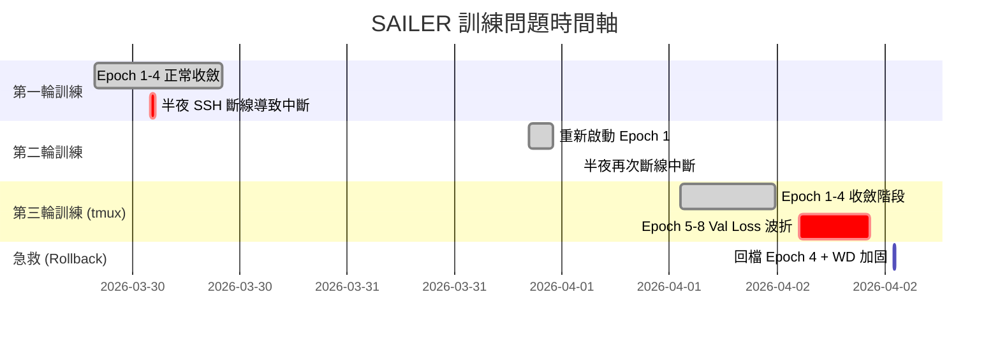

# SAILER 訓練問題紀錄與根因分析報告

> 時間範圍：2026/03/29 ~ 2026/04/02
> 
> 模型：SAILER (Speech-Audio Integrated Learning for Emotion Recognition)
> 
> 資料集：MSP-Podcast 2.0
> 
> 硬體環境：NVIDIA RTX 3090 (24GB VRAM) / FCU Server3

---

## 一、問題時間軸總覽

---

## 二、遇到的所有問題清單

### 問題 1：SSH 斷線導致訓練進程被殺死
| 項目 | 內容 |
|------|------|
| **發生時間** | 2026/03/30 凌晨、2026/04/01 凌晨 |
| **現象** | VS Code Remote SSH 連線中斷後，訓練進程收到 `SIGHUP` 信號被作業系統終止 |
| **根因** | 訓練進程直接掛在 SSH 連線的 TTY 下，連線斷開等於進程消亡 |
| **解決方案** | 改用 `tmux` 終端復用器，將訓練進程掛在一個與 SSH 連線無關的虛擬終端中 |
| **狀態** | ✅ 已解決 |

---

### 問題 2：斷點續傳 (Resume) 時最佳指標被歸零
| 項目 | 內容 |
|------|------|
| **發生時間** | 2026/04/01 發現 |
| **現象** | 使用 `--resume` 續傳後，模型以低於先前最佳成績的表現覆蓋了 `best_model_f1.pth` |
| **根因** | `train.py` 中 `best_f1 = 0.0` 和 `best_min_map = 0.0` 的初始化語句位於 Resume 載入邏輯**之後**，導致從 checkpoint 讀取的歷史最佳值 (如 F1=0.3654) 被立即覆蓋為 0.0 |
| **程式碼位置** | [train.py](file:///home/brant/Project/SAILER_test/train.py) 原第 155-156 行 |
| **解決方案** | 將 `best_f1` 和 `best_min_map` 的初始化移到 Resume 載入邏輯**之前** (第 116-117 行)，確保 Resume 讀取的值能正確覆蓋預設值 |
| **狀態** | ✅ 已解決 |

> [!WARNING]
> 這是本次訓練中最嚴重的 Bug。它會導致「最優模型」被較差的模型覆蓋，直接損害最終實驗成果。

---

### 問題 3：Epoch 5-8 驗證損失 (Val Loss) 出現鋸齒波折

| 項目 | 內容 |
|------|------|
| **發生時間** | 2026/04/02 凌晨 (Epoch 5 開始) |
| **現象** | Train Loss 持續穩定下降 (2.13→1.48)，但 Val Loss 在 Epoch 4 觸底後開始反彈上升 (1.786→1.840)，Macro F1 從 0.3654 退步至 0.34 |
| **狀態** | 🔍 已分析根因，正在觀察加固方案效果 |

#### 根因深度分析

經過全面檢查 `train.py`、`sailer_model.py`、`msp_dataset.py` 後，我們判定 **Val Loss 波折主要來自以下三個因素的疊加**：

##### 因素 A：過擬合 (Overfitting) — 主要原因

| Epoch | Train Loss | Val Loss | 差距 (Gap) | Macro F1 |
|-------|-----------|---------|-----------|----------|
| 1     | 2.135     | 1.865   | 0.270     | 0.337    |
| 2     | 1.706     | 1.790   | -0.084    | 0.363    |
| 3     | 1.641     | 1.787   | -0.146    | 0.360    |
| **4** | **1.597** | **1.786** | **-0.189** | **0.365** |
| 5     | 1.559     | 1.812   | -0.253    | 0.350    |
| 6     | 1.530     | 1.787   | -0.257    | 0.360    |
| 7     | 1.504     | 1.828   | -0.324    | 0.350    |
| 8     | 1.477     | 1.840   | -0.363    | 0.340    |

> [!IMPORTANT]
> **關鍵觀察**：Train Loss 與 Val Loss 之間的 Gap 在 Epoch 4 之後持續擴大 (0.189 → 0.363)。這是過擬合的典型數學特徵：模型在訓練集上越來越好，但在驗證集上反而變差。

##### WandB 圖表逐段解讀

以下對照 WandB 上的 Val Loss / Train Loss 曲線，將 X 軸的 Step 數對應回每個 Epoch（每 Epoch ≈ 2,756 steps）：

| 圖上 Step | Epoch | Val Loss | Train Loss | 模型狀態說明 |
|----------|-------|----------|------------|------------|
| ~2.7k | 1 | 1.865 | 2.13 | 🟢 起步階段，兩邊 Loss 都很高，屬正常現象 |
| ~5.5k | 2 | **1.790** ↓ | 1.71 | 🟢 大幅進步，模型快速學會 Happy、Angry 等主流情緒 |
| ~8.3k | 3 | **1.787** ↓ | 1.64 | 🟢 持續收斂，Val Loss 逼近谷底 |
| ~11k | **4** | **1.786** ⭐ | 1.60 | 🟢 **巔峰時刻**：Val Loss 最低、F1 最高 (0.3654) |
| ~13.8k | 5 | **1.812** ↑ | 1.56 | 🟡 **第一次異常跳升**：Val 上升但 Train 繼續下降 |
| ~16.5k | 6 | 1.787 ↓ | 1.53 | 🟡 看似恢復，但 Train-Val Gap 持續擴大 |
| ~19.3k | 7 | **1.828** ↑↑ | 1.50 | 🔴 **再次跳高**，振幅比第一次更大 |
| ~22k | 8 | **1.840** ↑↑↑ | 1.48 | 🔴 **確認失控**，Val Loss 一路飆升，過擬合成立 |

> [!CAUTION]
> **一句話總結這張圖**：模型在 Epoch 4 達到最佳表現後出現過擬合 (Overfitting)，Train Loss 持續下降但 Val Loss 反彈上升，Train-Val Gap 從 0.19 擴大至 0.36，確認 Weight Decay (0.0001) 不足以抑制正規化需求。

**白話比喻**：Train Loss 就像一個學生在家練考古題，越練越熟，分數穩定上升。Val Loss 則是拿「他沒看過的新題目」去考。Epoch 1-4 他考得越來越好，但從 Epoch 5 開始，他雖然考古題背得更熟了，面對新題目反而考得更差了 —— 因為他開始「死背答案」而非「理解原理」。

##### 因素 B：Weight Decay 不足

- **原始設定**：`weight_decay = 0.0001`
- **問題**：Weight Decay 負責限制模型權重的膨脹，防止過度記憶訓練資料中的雜訊。0.0001 的值對於此模型規模而言太弱，未能有效抑制過擬合。
- **修正**：提升至 `weight_decay = 0.001` (10 倍強化)

##### 因素 C：Cosine Scheduler 與 Resume 的交互問題

- 當我們使用 `--resume` 從 Epoch 4 恢復時，因為沒有讀取原始的 Scheduler 狀態，Cosine 學習率排程器會從**頭開始計算**。
- 這意味著 Epoch 5 (恢復後的第一個 Epoch) 會再次經歷 Warmup 階段，學習率從 0 緩慢爬升。這實際上對我們有利，因為它相當於一個自然的「降速」效果。

---

### 問題 4：WandB `ConfigError` — 續傳時修改參數被拒絕

| 項目 | 內容 |
|------|------|
| **發生時間** | 2026/04/02 12:57 |
| **現象** | `wandb.sdk.lib.config_util.ConfigError: Attempted to change value of key "epochs" from 15 to 18` |
| **根因** | WandB 在 `resume` 模式下預設禁止修改已記錄的超參數，以維護實驗的一致性 |
| **程式碼位置** | [experiment_tracker.py](file:///home/brant/Project/SAILER_test/src/experiment_tracker.py) 第 152 行 |
| **解決方案** | 在 `wandb.config.update()` 中加入 `allow_val_change=True` 參數 |
| **狀態** | ✅ 已解決 |

---

### 問題 5：Resume 時的 `KeyError: 'optimizer_state_dict'`

| 項目 | 內容 |
|------|------|
| **發生時間** | 2026/04/02 13:00 |
| **現象** | 手動建立的回檔 checkpoint 中只包含模型權重，缺少 Optimizer/Scheduler/Scaler 的狀態 |
| **根因** | 回檔操作 (Rollback) 使用的是 `best_model_f1.pth`（僅含模型權重），而非完整的 `checkpoint_latest.pth` |
| **程式碼位置** | [train.py](file:///home/brant/Project/SAILER_test/train.py) 第 133-138 行 |
| **解決方案** | 將 Optimizer/Scheduler/Scaler 的載入改為可選式 (`if key in checkpoint`)，允許僅使用模型權重進行恢復 |
| **狀態** | ✅ 已解決 |

---

## 三、目前的訓練狀態

| 項目 | 數值 |
|------|------|
| **當前 Epoch** | 6/18 (從 Epoch 4 最強權重回檔後重新起跑) |
| **當前狀態** | 全新訓練 (從 Epoch 1 重新開始，全新 WandB Run) |
| **學習率 (LR)** | 0.0004 (與論文 0.0005 一致) |
| **權重衰減 (WD)** | 0.001 (從 0.0001 提升 10 倍，加強正規化) |
| **Batch Size** | 32 (從 64 降為 32，與論文環境對齊) |
| **梯度裁剪** | max_norm=1.0 (新增) |
| **運行環境** | tmux session `sailer` (抗斷線) |

---

## 四、已實施的防護措施總表

| 措施 | 說明 | 影響範圍 |
|-----|------|---------|
| `tmux` 終端復用器 | 訓練進程與 SSH 連線脫鉤，斷線不影響訓練 | 運維穩定性 |
| 斷點續傳 (Auto-Resume) | 支援從最新 checkpoint 恢復，包含完整的模型、優化器、排程器狀態 | 容災能力 |
| 指標保護 (Metrics Persistence) | `best_f1` 和 `best_min_map` 正確持久化於 checkpoint 中，初始化位於 Resume 之前 | 模型品質 |
| 可選式載入 (Optional Loading) | Optimizer/Scheduler 狀態缺失時自動使用新的，不再報錯 | 回檔操作 |
| WandB 參數靈活更新 | 允許在續傳時修改超參數 (如 epochs, weight_decay) | 實驗靈活性 |
| Weight Decay 加固 | 從 1e-4 提升至 1e-3，抑制過擬合 | 訓練穩定性 |
| 梯度裁剪 (Gradient Clipping) | `max_norm=1.0`，防止異常 batch 產生超大梯度導致權重劇烈跳動 | 訓練穩定性 |
| Batch Size 縮小 | 從 64 降至 32，提供隱性正規化效果，與論文環境對齊 | 泛化能力 |

---

## 五、Batch Size 選擇分析

### 為什麼 Batch Size 會影響訓練穩定性？

根據深度學習的**線性縮放規則 (Linear Scaling Rule)**，學習率需要與 Batch Size 成正比調整：

- **論文環境** (推測 BS=16, LR=0.0005)：每個樣本的有效步長 ≈ 3.1e-5
- **原配置** (BS=64, LR=0.0004)：每個樣本的有效步長 ≈ 6.25e-6 → 但 BS=64 的梯度估計更平滑，實際跨步更大
- **新配置** (BS=32, LR=0.0004)：與論文環境最接近的平衡點

### Batch Size 對比表

| Batch Size | 預估 VRAM | 每 Epoch 時間 | 18 Epoch 總時間 | 穩定性 | 推薦度 |
|-----------|-----------|-------------|---------------|--------|--------|
| 16 | ~5 GB | ~5 小時 | ~90 小時 (3.7天) | ⭐⭐⭐ | 最穩但太慢 |
| **32** | **~7 GB** | **~3.3 小時** | **~60 小時 (2.5天)** | **⭐⭐⭐** | **✅ 採用** |
| 48 | ~9 GB | ~2.8 小時 | ~50 小時 (2.1天) | ⭐⭐ | 可考慮 |
| 64 (舊) | ~11 GB | ~2.5 小時 | ~45 小時 (1.9天) | ⭐ | ❌ 已證實不穩 |

> [!NOTE]
> 較小的 Batch Size 帶來更多的梯度噪音，這在深度學習中被稱為「隱性正規化 (Implicit Regularization)」。這種噪音可以幫助模型跳出不好的局部最小值，減少過擬合。

---

## 六、後續觀察重點

1. **Val Loss 趨勢**：全新訓練的 Epoch 1-8 是否呈現平滑下降（不再出現鋸齒波折）
2. **Macro F1 目標**：是否能突破 0.37 並穩定維持
3. **Train-Val Gap**：是否控制在 0.20 以內（代表正規化成功）
4. **少數類別表現**：Fear、Disgust、Surprise、Contempt 的 F1 是否持續改善
5. **梯度裁剪效果**：可在 WandB 觀察 batch_loss 的波動幅度是否比上次小

